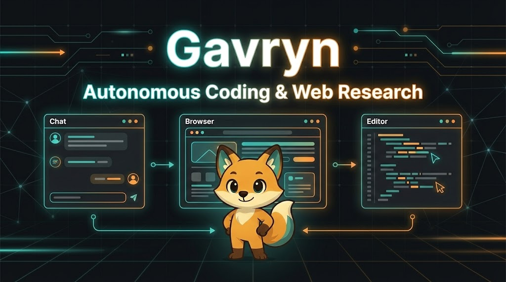
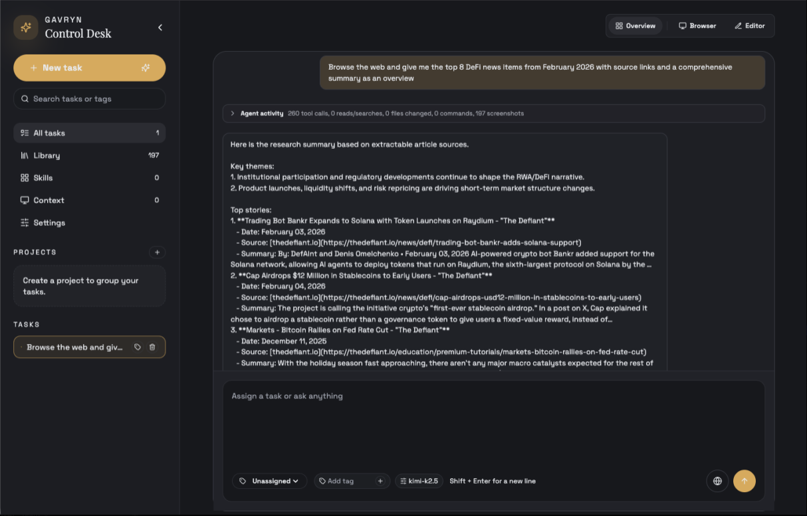
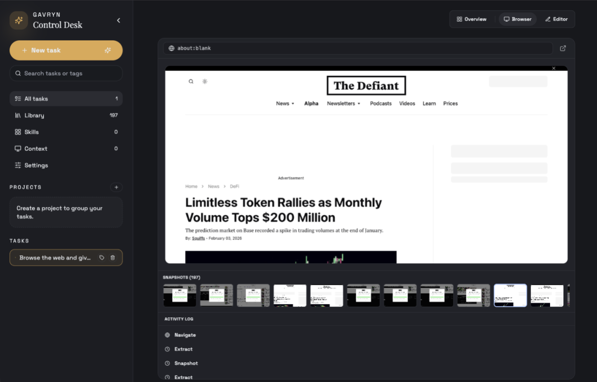

<p align="center">
  
</p>

## Table of Contents

- [Gavryn Local](#gavryn-local)
- [What Gavryn Is](#what-gavryn-is)
- [Product Experience](#product-experience)
  - [Research + Execution Flow](#research--execution-flow)
  - [Live Browser Automation](#live-browser-automation)
- [Architecture](#architecture)
- [Repository Layout](#repository-layout)
- [Quickstart](#quickstart)
  - [Prerequisites](#prerequisites)
  - [Recommended (one command)](#recommended-one-command)
  - [Common commands](#common-commands)
- [Deployment Options](#deployment-options)
- [Manual Service Startup (optional)](#manual-service-startup-optional)
- [LLM Setup](#llm-setup)
  - [Supported providers](#supported-providers)
- [Core Tooling](#core-tooling)
  - [Browser tools](#browser-tools)
  - [Editor + process tools](#editor--process-tools)
  - [Document tools](#document-tools)
- [Automations + API Harness](#automations--api-harness)
- [Notifications](#notifications)
- [Configuration](#configuration)
- [Testing](#testing)
- [Documentation](#documentation)
- [License](#license)
- [Contributing](#contributing)

# Gavryn Local

Local-first AI control plane for autonomous coding and web research.

Gavryn combines a Go control plane, Temporal workflows, Postgres persistence, Node workers, and a React UI so you can run powerful agent tasks on your own infrastructure.

## What Gavryn Is

- **Agent control room** for long-running tasks with streaming activity
- **Built-in browser automation** for navigation, extraction, and research workflows
- **Code + file operations** through editor and process tools
- **Artifact generation** for reports and documents (`.docx`, `.pptx`, `.pdf`, `.csv`)
- **Durable state** for runs, events, artifacts, context, skills, memory, and automations

## Product Experience

### Research + Execution Flow

<p align="center">
  
</p>

### Live Browser Automation

<p align="center">
  
</p>

## Architecture

- **Control plane**: Go API + SSE + Temporal orchestration
- **Database**: Postgres (`pgvector` for hybrid memory search)
- **Workers**:
  - Browser worker (Playwright + user-tab mode support)
  - Tool runner (editor/process/document tools)
- **Frontend**: Vite + React + Tailwind + shadcn/ui

## Repository Layout

```text
gavryn-local/
├── control-plane/        # Go API + Temporal worker
├── frontend/             # Vite React UI
├── workers/              # Browser + tool-runner services
├── infra/migrations/     # SQL migrations
├── scripts/              # Dev/smoke/automation scripts
├── docker-compose.yml    # Postgres + Temporal
└── Makefile              # Common dev commands
```

## Quickstart

### Prerequisites

- Go 1.22+
- Node 18+
- Docker

### Recommended (one command)

```bash
cp .env.example .env
make dev
```

This boots dependencies, applies migrations, and starts local services.

### Common commands

```bash
make dev      # full local stack
make smoke    # smoke checks
make up       # only docker dependencies
make down     # stop docker dependencies
```

## Deployment Options

### 1) Single VM + Docker Compose (fastest path)

Best for early production and most self-hosted teams.

- Providers: Hetzner, DigitalOcean, AWS EC2, GCP Compute Engine
- Run Postgres + Temporal + control-plane + workers + frontend on one machine
- Add reverse proxy + TLS (Caddy or Nginx)

### 2) VM apps + managed Postgres (recommended next step)

Best when you want better database reliability without full Kubernetes.

- Keep Gavryn services on VM(s)
- Move DB to managed Postgres (RDS / Cloud SQL / DO Managed PG)
- Keep migrations in CI/CD or release scripts

### 3) Kubernetes (advanced)

Best for larger scale, multi-env, and strict ops controls.

- Run Gavryn services on K8s
- Use managed Postgres + external Temporal or self-host Temporal
- Add autoscaling, secret management, and observability stack

## Manual Service Startup (optional)

Use this if you want to run each component yourself.

1. Start dependencies and migrations:

```bash
docker compose up -d
for migration in infra/migrations/*.sql; do psql "$POSTGRES_URL" -f "$migration"; done
```

2. Start control plane and Temporal worker:

```bash
cd control-plane && go run ./cmd/control-plane
cd control-plane && go run ./cmd/worker
```

3. Start workers:

```bash
cd workers/browser && npm install && npm run dev
cd workers/tool-runner && npm install && npm run dev
```

4. Start frontend:

```bash
cd frontend && npm install && npm run dev
```

## LLM Setup

Configure providers from **Settings** in the UI.

Important:

- Set `LLM_SECRETS_KEY` in `.env` (32-byte base64) to persist encrypted provider credentials.
- Without `LLM_SECRETS_KEY`, connection tests may pass but saving settings will fail.

Generate a key:

```bash
openssl rand -base64 32
```

### Supported providers

- Codex (via local Codex auth)
- OpenAI
- OpenRouter
- OpenCode Zen
- Kimi for Coding
- Moonshot AI

## Core Tooling

### Browser tools

- `browser.navigate`
- `browser.snapshot`
- `browser.click`
- `browser.type`
- `browser.scroll`
- `browser.extract`
- `browser.evaluate`
- `browser.pdf`

### Editor + process tools

- `editor.list`, `editor.read`, `editor.write`, `editor.delete`, `editor.stat`
- `process.exec`

### Document tools

- `document.create_pptx`
- `document.create_docx`
- `document.create_pdf`
- `document.create_csv`

## Automations + API Harness

Run a prompt through the automation endpoint from terminal:

```bash
./scripts/run-automation.sh "Browse the web and summarize top DeFi news with sources"
```

Useful env vars:

- `CONTROL_PLANE_URL`
- `WAIT_FOR_COMPLETION`
- `AUTOMATION_TIMEOUT_MS`
- `AUTOMATION_POLL_INTERVAL_MS`
- `MODEL_ROUTE`
- `BROWSER_MODE`
- `BROWSER_INTERACTION`

## Notifications

Gavryn can send Discord notifications when scheduled/manual automation jobs complete.

- Set `DISCORD_WEBHOOK_URL` in your environment
- On completion, Gavryn posts status, trigger, run ID, reason, and a trimmed response summary
- Notification failures are logged but do not fail the automation run

Example:

```bash
DISCORD_WEBHOOK_URL=https://discord.com/api/webhooks/...
```

## Configuration

See `.env.example` for the full list.

Most important keys:

- `POSTGRES_URL`
- `CONTROL_PLANE_URL`
- `TOOL_RUNNER_URL`
- `BROWSER_WORKER_URL`
- `VITE_API_BASE_URL`
- `LLM_SECRETS_KEY`
- `DISCORD_WEBHOOK_URL`
- `ALLOWED_TOOLS`
- `PROCESS_ALLOWLIST`

## Testing

```bash
cd control-plane && go test ./... && go vet ./...
cd workers/tool-runner && npm test
cd workers/browser && npm test
cd frontend && npm test -- --run
cd frontend && npm run build
cd frontend && npm run e2e
```

## Documentation

Detailed docs live in [`docs/`](./docs/):

- [Overview](./docs/overview.md)
- [Architecture](./docs/architecture.md)
- [Local Development](./docs/local-dev.md)
- [Runbook](./docs/runbook.md)
- [API Reference](./docs/api-reference.md)
- [Workflows](./docs/workflows.md)
- [Configuration](./docs/configuration.md)
- [Troubleshooting](./docs/troubleshooting.md)
- [Data Model](./docs/data-model.md)

## License

Licensed under the **MIT License**. See [LICENSE](LICENSE).

## Contributing

Contributions are welcome. Please read [CONTRIBUTING.md](CONTRIBUTING.md) first.
